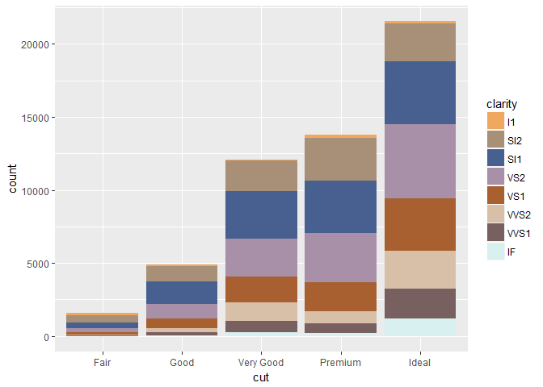
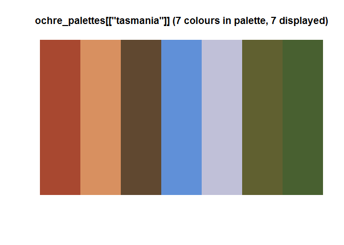

# Australia-themed Colour Palettes

Ochre is a brownish-yellow pigment that occurs naturally in soils across Australia. Historically, ochre has been used for artwork by many indigenous cultures, including the Aboriginal people of Australia.

The goal of `ochRe` is to provide colour palettes inspired by Australian art, landscapes and wildlife. The palettes can be used in conjunction with `ggplot2` or `plot` to provide colours to data plots.
There are 14 different palettes (at the moment!), each one based on an iconic Australian artwork, landscape or creature.
Some palettes are more suitable for displaying qualitative data, others will look fabulous used in sequential plots.
More information can be found in the vignette, including which palettes work best for those with impaired colour vision.

```r
# load the ochRe vignette
vignette("ochRe_intro")
```

## Installation

You can install `ochRe` from github with:

```r
# You need to install the 'devtools' package first
devtools::install_github("ropenscilabs/ochRe")
```

## Example

This is a basic example of how to use the `namatjira_qual` palette in a plot.


```r
library(ochRe)
library(ggplot2)
ggplot(diamonds) + geom_bar(aes(x = cut, fill = clarity)) +
  scale_fill_ochre()
```

<!-- -->

In this example we use the `winmar` palette directly via the `colorRampPalette()` function (for the base plot connoisseurs). 


```r
## basic example code
pal <- colorRampPalette(ochre_palettes[["winmar"]])
image(volcano, col = pal(20))
```

<!-- -->

Individual palettes can be visualised using the viz_palette function

```r
viz_palette(ochre_palettes[["tasmania"]])
```

<!-- -->

